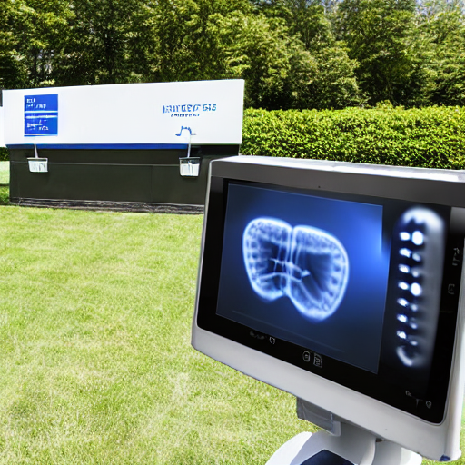
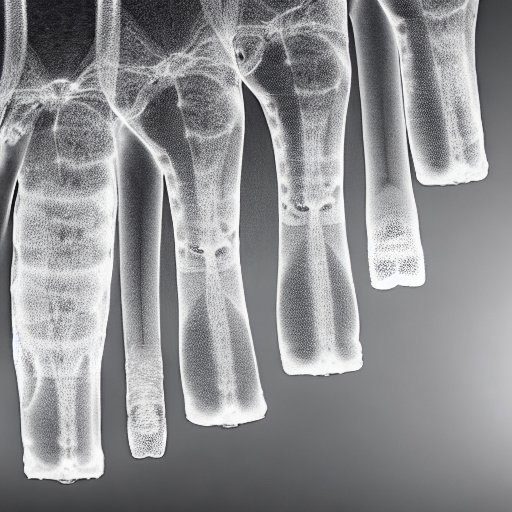
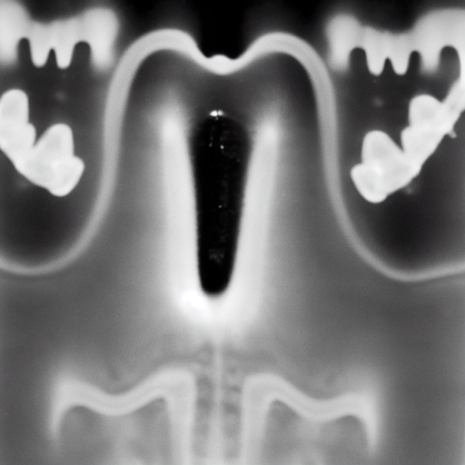
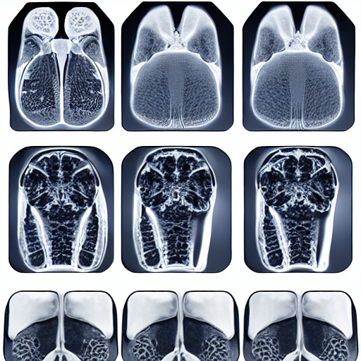
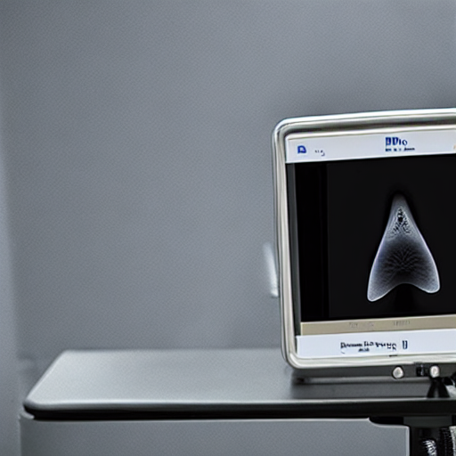
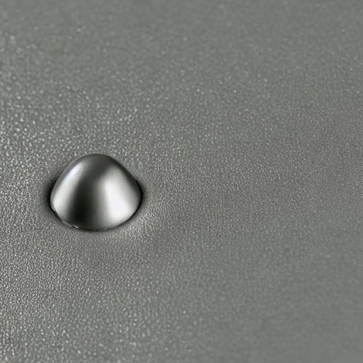
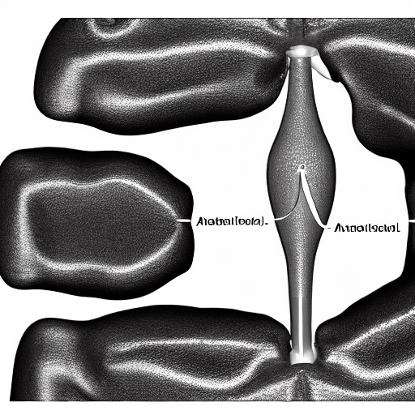

# 🩺 Medical Image Generator (Stable Diffusion)

This project demonstrates how to generate **synthetic medical images** (X-ray, MRI, CT, Ultrasound, Microscopic, Anatomical, and Prostate-specific scans) using **Stable Diffusion**.
It uses optimized prompts for realistic medical imaging outputs without fine-tuning.

---

## 🚀 Features

* Generate **X-ray, MRI, CT, Ultrasound, Microscopic, Anatomical** scans.
* Generate **prostate-specific medical images**.
* Custom medical prompt support.
* Batch generation for multiple scan categories.
* Automatic saving of generated images in `.png` format.

---

## 📂 Example Outputs

Here are some sample generated outputs:

* **Ultrasound Scan**
  

* **X-Ray Scan**
  
  
  

* **Prostate Medical Scans**
  
  
  
  
  

---

## 📦 Installation

Clone this repository and install the required dependencies:

```bash
git clone https://github.com/your-username/medical-image-generator.git
cd medical-image-generator
pip install -r requirements.txt
```

**Requirements (`requirements.txt`):**

```
torch
diffusers
transformers
accelerate
safetensors
Pillow
```

---

## 🧑‍💻 Usage

Run the script to generate images:

```bash
python untitled0.py
```

### Options inside the script:

1. **Generate X-rays:**

   ```python
   xray_images = generator.generate_medical_image("xray", num_images=3)
   ```

2. **Generate prostate-specific scans:**

   ```python
   prostate_images = generator.generate_prostate_specific()
   ```

3. **Custom medical scan (e.g., kidney stones):**

   ```python
   custom_image = generator.generate_medical_image(
       custom_prompt="medical scan of kidney stones, diagnostic imaging, urological"
   )
   ```

4. **Batch generate multiple types:**

   ```python
   batch_images = generator.batch_generate(
       categories=["mri", "ct", "ultrasound"],
       images_per_category=2
   )
   ```

All images will be saved as `medical_<type>_<id>.png` or `prostate_medical_<id>.png`.

---

## ⚠️ Disclaimer

* These are **synthetic images generated by AI**, not real medical data.
* This project is for **research, educational, and demonstration purposes only**.
* Not intended for clinical or diagnostic use.

---

## 📌 Colab Link

👉 [Run in Google Colab]([https://colab.research.google.com/drive/1sUr2FxkmKmFExRsSmbQtF7Wdn5M3JOen](https://colab.research.google.com/drive/1sUr2FxkmKmFExRsSmbQtF7Wdn5M3JOen?usp=sharing))

---
